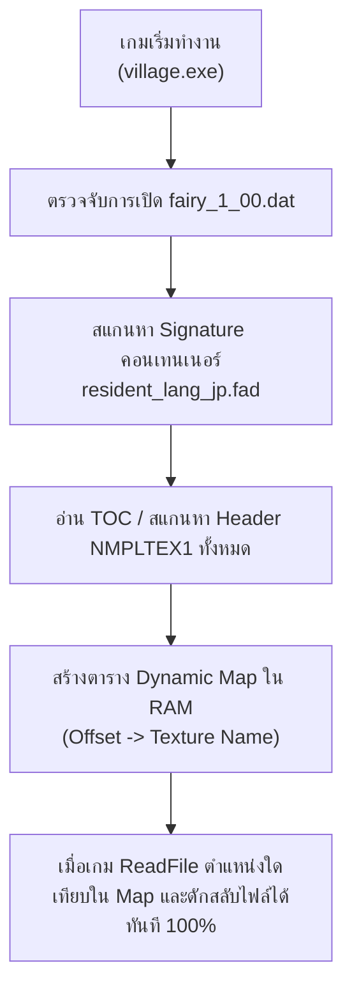

# แผนงานและการรับมือในอนาคต: เมื่อตำแหน่งภาพ (Texture Offset) ในเกมเปลี่ยนไป
**เป้าหมาย:** แก้ไขปัญหาภาพใน `Mods\TextDump\textures` ไม่เปลี่ยนเมื่อเกมมีการอัปเดตเวอร์ชัน หรือเล่นคนละเวอร์ชัน (เช่น Steam 1.10 vs Baidu 1.08)  
**ตำแหน่งโฟลเดอร์ Mod:** `C:\Program Files (x86)\Steam\steamapps\common\Village in the Shade\Mods`  
**โฟลเดอร์ไฟล์ภาพ:** `C:\Program Files (x86)\Steam\steamapps\common\Village in the Shade\Mods\TextDump\textures`

---

## 1. สาเหตุที่ภาพ "ไม่เปลี่ยน" เมื่อเล่นคนละเวอร์ชัน (Root Cause Analysis)

### 1.1 โครงสร้างการเก็บ Texture ของเกม
เกม *Village in the Shade* ไม่ได้เก็บไฟล์ UI เป็นภาพเดี่ยวๆ แต่เก็บรวมอยู่ในคลังขนาดใหญ่:
```
data\fairy_1_00.dat (คลังใหญ่หลายร้อย MB)
   └── data\fairy\resident_lang_jp.fad (ไฟล์ Container รวม Texture UI)
         ├── [Index 03] ui_0020_カレンダー.nltx
         ├── [Index 29] ui_2030_詳細ポップアップ.nltx
         ├── [Index 30] ui_1153_ウィンドウ.nltx
         └── ... (รวมกว่า 400+ ภาพ)
```

### 1.2 กลไกของระบบ VFS Hook (`text_dump.dll`)
1. ปลั๊กอินดักฟังก์ชัน Win32 API: `ReadFile` เมื่อเกมอ่านไฟล์ `fairy_1_00.dat`
2. ปลั๊กอินจะดูว่าเกมกำลังอ่านที่ตำแหน่ง **Offset (ไบต์ที่เท่าไหร่)**
3. ถ้าตำแหน่ง Offset ตรงกับตาราง `g_fad_subfiles` ในโค้ด DLL ➔ ปลั๊กอินจะสลับเอาข้อมูลจากไฟล์ใน `Mods\TextDump\textures\<ชื่อภาพ>.nltx` ส่งให้เกมแทน

### 1.3 ทำไมเมื่อเกมอัปเดตแล้วภาพถึงไม่เปลี่ยน?
* **เมื่อเกมอัปเดตแพตช์ใหม่:** ผู้พัฒนาเกมมีการเพิ่ม/ลด หรือแก้ไขไฟล์ที่อยู่ต้นๆ ของ `fairy_1_00.dat` ทำให้ **Offset (ตำแหน่งไบต์) ของไฟล์ทั้งหมดขยับเลื่อน (Shift)**
* **ตัวอย่างจริง:**
  * ในเกม **v1.08 (Baidu):** `ui_1153_ウィンドウ` อยู่ที่ Offset `0x4336E100`
  * ในเกม **v1.10 (Steam):** `ui_1153_ウィンドウ` ขยับไปอยู่ที่ Offset `0x433B9380` (เลื่อนไป `+0x4B280` ไบต์!)
* **ผลลัพธ์:** ถ้าตารางในโค้ด C ฟิกซ์ Offset ของ v1.10 ไว้ แต่ผู้เล่นนำไปเปิดบน v1.08 ➔ ปลั๊กอินจะ **"ดักไม่เจอ (Miss)"** เพราะตำแหน่งไม่ตรงกัน เกมจึงไปโหลดภาพต้นฉบับภาษาญี่ปุ่นออกมาแสดงผลแทน!

---

## 2. ขั้นตอนการแก้ไขเมื่อเกมอัปเดตใหม่ (Step-by-Step Manual Fix)

เมื่อเกมมีอัปเดตแพตช์ใหม่ แล้วพบว่าภาพเมนู/UI บางภาพหรือทั้งหมดหลุดกลับไปเป็นภาษาเดิม:

### ขั้นที่ 1: ตรวจสอบตำแหน่ง Offset ใหม่จาก Log
เปิดไฟล์บันทึกการเข้าถึงไฟล์:
`Mods\TextDump\file_access.log`
ค้นหาบรรทัดที่เกมอ่าน `fairy_1_00.dat` ในช่วงเวลาที่เปิดหน้าจอนั้นๆ เช่น:
```
[READ_ARCHIVE] fairy_1_00.dat   Offset: 0x433XXXXX (XXXX B)
```
ค่า Offset นี้คือตำแหน่งจริงที่ตัวเกมเวอร์ชันปัจจุบันกำลังเรียกใช้งาน

### ขั้นที่ 2: ใช้สคริปต์สแกน Offset ทั้งหมดแบบอัตโนมัติ
ในโฟลเดอร์โปรเจกต์ `Village_in_the_Shade_ThaiMod_Dev\scripts` มีสคริปต์สำหรับสแกนหา Offset ของทุกภาพใน `fairy_1_00.dat`:
```cmd
python scripts\get_target_offsets.py
```
**หลักการทำงานของสคริปต์:**
1. กระโดดไปหาจุดเริ่มต้นของคอนเทนเนอร์ `resident_lang_jp.fad`
2. ค้นหา Signature Header ของภาพคือไบต์ `NMPLTEX1`
3. บันทึก Index และ Offset ของภาพทั้ง 65 ภาพออกมาเป็นตาราง C ทันที

### ขั้นที่ 3: อัปเดตตารางใน `src\text_dump.c`
นำ Offset ที่ได้ไปวางแทนที่ตาราง `g_fad_subfiles[]` ในไฟล์ `src\text_dump.c`:
```c
static const FadSubFile g_fad_subfiles[] = {
    /* ui_1153_ウィンドウ (1024x1024, index 30) */
    { 0x[OFFSET_DESC]ULL, "ui_1153_ウィンドウ.nltx", "ui_1153_ウィンドウ_thai.nltx", 1024, 1024, TRUE },
    { 0x[OFFSET_DATA]ULL, "ui_1153_ウィンドウ.nltx", "ui_1153_ウィンドウ_thai.nltx", 1024, 1024, FALSE },
    ...
};
```
*(หมายเหตุ: แต่ละภาพจะมี 2 ตำแหน่ง คือ Offset Header Descriptor (-32 ไบต์) และ Offset Data Body)*

### ขั้นที่ 4: คอมไพล์ DLL ใหม่
รันสคริปต์คอมไพล์:
```cmd
build.bat
```
ไฟล์ `text_dump.dll` ตัวใหม่จะถูกสร้างและนำไปติดตั้งที่ `Mods\TextDump\text_dump.dll` ทันที

---

## 3. แผนพัฒนาในอนาคต: ระบบตรวจจับตำแหน่งอัตโนมัติ (Dynamic Auto-Offset Detection)

เพื่อไม่ให้ต้องมาคอยอัปเดต Offset ทุกครั้งที่เกมอัปเดตแพตช์ มีแนวทางสถาปัตยกรรม 2 รูปแบบที่วางแผนนำมาใช้:

### แผน A: Dynamic Runtime TOC Scanning (แนะนำสูงสุด ⭐⭐⭐⭐⭐)
ให้ `text_dump.dll` ค้นหาตำแหน่งเองตั้งแต่ตอนเริ่มเกม (ในฟังก์ชัน `init_vfs` หรือเมื่อเกมเปิด `fairy_1_00.dat` ครั้งแรก):



**ข้อดี:**
* **ทนทานถาวร:** รองรับได้ทั้ง v1.08, v1.10 และแพตช์เวอร์ชันใหม่ๆ ในอนาคต โดยไม่ต้องแก้ไขโค้ด C หรือคอมไพล์ DLL ใหม่เลย
* ผู้เล่นเพียงแค่นำไฟล์ `.nltx` วางในโฟลเดอร์ `Mods\TextDump\textures` ตัวเกมจะดึงไปใช้ได้ทันที

### แผน B: Multi-Version Offset Table (โซลูชันระยะกลาง)
ในกรณีที่ยังใช้ตาราง Hardcode:
* เพิ่มรายการ Offset ของทั้งเวอร์ชัน **1.08 (Baidu/DLsite)** และ **1.10 (Steam)** ลงในตาราง `g_fad_subfiles` พร้อมกันทั้งคู่
* เนื่องจากตำแหน่ง Offset ของ 1.08 และ 1.10 ไม่ทับซ้อนกัน ปลั๊กอินจึงสามารถดักจับได้ถูกต้องไม่ว่าจะเปิดเล่นบนตัวเกมเวอร์ชันไหน

---

## 4. โครงสร้างไฟล์ Texture ในโฟลเดอร์ `Mods\TextDump\textures`

ไฟล์ในโฟลเดอร์นี้จะต้องเป็นฟอร์แมต **`.nltx`** ที่บีบอัดถูกต้องตามมาตรฐานของเอนจินเกม:
1. **Header:** `NMPLTEX1` (ขนาด 128 ไบต์) ระบุ Resolution และ DXGI Format (`0x66` = `BC7_UNORM`)
2. **Compression Header:** `YKCMP_V1` Type 9 (LZ4)
3. **Payload:** บล็อกพิกเซล BC7 ที่ถูกบีบอัดด้วย LZ4

### การสร้างหรือแก้ไขภาพใหม่:
1. แต่งภาพต้นแบบบันทึกเป็น `.png` (โหมด RGBA 32-bit ขนาดพิกเซลเท่าเดิมเป๊ะ)
2. รันสคริปต์สร้างภาพและแพ็กเป็น `.nltx`:
   ```cmd
   python scripts\generate_ui_textures.py
   ```
3. สคริปต์จะใช้ `texconv.exe` แปลงเป็น BC7 ➔ บีบอัด LZ4 ➔ แปะหัว `NMPLTEX1` ➔ ติดตั้งลงในโฟลเดอร์ `textures` ให้โดยอัตโนมัติ

---

## 5. สรุปเช็กลิสต์ตรวจสอบเมื่อเกิดปัญหา

| อาการที่พบ | สาเหตุที่เป็นไปได้ | วิธีตรวจสอบและแก้ไข |
| :--- | :--- | :--- |
| **ภาพหลุดเป็นภาษาญี่ปุ่น** | ตำแหน่ง Offset ใน DLL ไม่ตรงกับเวอร์ชันเกม | เช็ก `file_access.log` ดู Offset ล่าสุด แล้วรัน `get_target_offsets.py` เพื่ออัปเดต DLL |
| **ภาพหลุดเป็นภาษาอังกฤษ** | ไฟล์ `.nltx` ในโฟลเดอร์ `textures` ยังไม่ได้ถูกวาดแปลไทย | ตรวจสอบไฟล์ `.png` ใน `01_ภาพที่ม็อดเดิมแก้ไข_ทั้งหมด_65ภาพ\แก้แล้ว` แล้วรัน `generate_ui_textures.py` |
| **เกมเด้งหลุด (Crash)** | ไฟล์ `.nltx` มีขนาด กว้าง x ยาว ไม่ตรงกับต้นฉบับ | ตรวจสอบขนาดภาพ (Width x Height) ใน Header `NMPLTEX1` ต้องตรงกับค่าเดิมของเกม |
| **ไฟล์ในโฟลเดอร์ textures ไม่ถูกเรียก** | ปลั๊กอินหาโฟลเดอร์ไม่เจอ (Path คลาดเคลื่อน) | ตรวจสอบว่ามีโฟลเดอร์ `Mods\TextDump\textures` อยู่ในไดเรกทอรีเกมจริง |
