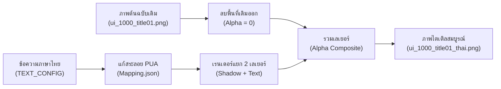

# คู่มือกระบวนการสร้างภาพไตเติลอัตโนมัติ (How Title Textures Were Created)
**เกม:** *Village in the Shade* (ほの暮しの庭)  
**เครื่องมือ:** Python + Pillow + PUA Font Engine

---

## 1. แนวคิดหลัก: ทำไมถึงไม่ต้องวาดมือเอง?

ในไฟล์ภาพ Spritesheet ของเกมคอมพิวเตอร์ ข้อความและปุ่มกดต่างๆ จะถูกจัดวางไว้ตาม **พิกัดพิกเซล (X, Y) ที่แน่นอน** 
หากใช้วิธีวาดมือด้วยโปรแกรมแต่งภาพทั่วไป อาจเกิดปัญหา:
- ขนาด Resolution หรือช่องสี Alpha คลาดเคลื่อน
- ฟอนต์ภาษาไทยสระลอยหรือวรรณยุกต์ชนกัน
- เสียเวลาอย่างมากหากต้องการแก้ไขคำแปลในภายหลัง

การใช้ **สคริปต์อัตโนมัติ (Automated Text-to-Texture)** จึงเข้ามาแก้ปัญหานี้ โดยเปิดโอกาสให้ผู้พัฒนาเพียงแค่ **"พิมพ์ข้อความที่ต้องการ"** ลงในดิกชันนารี จากนั้นโปรแกรมจะคำนวณตำแหน่ง, ลบภาพเดิม, จัดสระวรรณยุกต์ และเรนเดอร์แสงเงาให้ออกมาเหมือนต้นฉบับ 100% ภายใน 1 วินาที



---

## 2. ขั้นตอนการทำงานเบื้องหลัง 5 ขั้นตอน (5-Step Pipeline)

### ขั้นที่ 1: กำหนดพิกัดและลบข้อความเดิม (Coordinate Mapping & Erase Area)
สคริปต์จะระบายสีทับข้อความภาษาญี่ปุ่น/อังกฤษเดิมด้วยสีดำโปร่งใสสมบูรณ์ `(R=0, G=0, B=0, Alpha=0)` เพื่อให้จุดนั้นกลายเป็นพื้นหลังใส โดยไม่รบกวนขีดพู่กันหรือพื้นหลังส่วนอื่น:

| ข้อความเดิม | พิกัดสี่เหลี่ยมที่ถูกลบ `[X1, Y1, X2, Y2]` | องค์ประกอบที่ถูกลบ |
| :--- | :--- | :--- |
| `ほの暮しの庭` | `[90, 5, 930, 255]` | โลโก้ภาษาญี่ปุ่นตัวใหญ่ (เว้นขีดพู่กันด้านล่างไว้) |
| `権利表記` | `[960, 70, 1150, 125]` | ข้อความเมนูข้อมูลสิทธิ์/ลิขสิทธิ์ |
| `ゲームを終了する` | `[950, 195, 1200, 255]` | ข้อความเมนูออกจากเกม |
| `Press any button` | `[1010, 275, 1425, 365]` | ข้อความแจ้งเตือนกดปุ่ม |
| `はじめる` | `[1840, 160, 1995, 215]` | ข้อความปุ่มเริ่มเกม |
| `設定` | `[1610, 160, 1715, 215]` | ข้อความปุ่มตั้งค่า |

---

### ขั้นที่ 2: แก้ปัญหาสระลอยและวรรณยุกต์ซ้อน (PUA Shaping)
ในภาษาไทย การพิมพ์ตัวอักษรที่มีสระและวรรณยุกต์ซ้อนกัน เช่น คำว่า **"ปุ่ม"** (สระอุ + ไม้เอก) หรือ **"สิทธิ์"** (สระอิ + การันต์) หากใช้เอนจินทั่วไป สระและวรรณยุกต์อาจชนกันหรือลอยสูงผิดปกติ

สคริปต์จึงดึงตรรกะจาก `csv_to_pua_gui.py` ร่วมกับ `Mapping.json` โดยใช้อัลกอริทึม **Longest Match First**:
1. ตรวจสอบกลุ่มคำไทย เช่น `ปุ่ม`
2. ค้นหาในตาราง `Mapping.json` เพื่อหารหัสพิเศษใน **Private Use Area (PUA)**
3. แทนที่ด้วยอักขระสำเร็จรูปที่มีการปรับระดับความสูงของสระและวรรณยุกต์ไว้แล้วในฟอนต์ `lora-thai-jp-bold.ttf` ส่งผลให้สระและวรรณยุกต์วางตำแหน่งลงล็อกอย่างสมบูรณ์แบบ

---

### ขั้นที่ 3: สถาปัตยกรรมแยกเลเยอร์แสงเงา (Multi-Layer Rendering)
เพื่อให้ตัวหนังสือมีความกลมกลืนกับงานศิลป์ของเกมที่มีความฟุ้งละมุน สคริปต์จะเรนเดอร์แยกออกเป็น **3 เลเยอร์อิสระ**:

```
[Layer 3: Text Layer]    ตัวหนังสือสีครีมวินเทจ (#F7F1DF) + ขอบเข้ม (Stroke 1-2px)
        ▲
[Layer 2: Shadow Layer]  ตัวหนังสือสีดำโปร่งใส + ขยายขอบ + เบลอ (Gaussian Blur 3.5-4px)
        ▲
[Layer 1: Base Image]    ภาพพื้นหลังดั้งเดิมที่เจาะช่องใสรอไว้แล้ว
```

1. **Shadow Layer (เลเยอร์เงา):**
   - วาดตัวหนังสือด้วยสีดำโปร่งแสง `(0, 0, 0, Alpha ~ 140-160)`
   - ขยายเส้นขอบของเงาให้กว้างกว่าตัวหนังสือปกติ $+4$ ถึง $+8$ พิกเซล
   - นำเลเยอร์เงาไปผ่านฟิลเตอร์ **Gaussian Blur** (`radius=3.5` ถึง `4.0`) ทำให้ขอบเงามีความนุ่มฟุ้งกระจายเหมือนเงาตกกระทบตามธรรมชาติ
2. **Text Layer (เลเยอร์ตัวหนังสือ):**
   - วาดตัวหนังสือด้วยสีเนื้อครีมวินเทจ `#F7F1DF` (สำหรับโลโก้) และ `#DAD5D0` (สำหรับปุ่มกด)
   - ใส่เส้นขอบเข้มบางๆ (Stroke Width 1 ถึง 2 พิกเซล) สีถ่านไม้ `#201E1A` เพื่อตัดขอบให้คมชัด
3. **Alpha Blending:**
   - รวมเลเยอร์ทั้งหมดเข้าด้วยกันด้วยฟังก์ชัน `Image.alpha_composite`

---

### ขั้นที่ 4: การจัดระเบียบแนวตัวหนังสือ (Alignment Logic)

สคริปต์คำนวณจุดวางตัวหนังสือออกเป็น 2 รูปแบบ:

1. **การจัดกึ่งกลาง (Center Alignment):**
   - ใช้กับ **โลโก้ชื่อเกม** ($X=512, Y=140$) และ **ปุ่ม `กดปุ่มใดก็ได้`** ($X=1216, Y=320$)
   - คำนวณจากความกว้างของข้อความ: $TX = CenterX - \frac{TextWidth}{2}$ เพื่อให้จุดศูนย์กลางอยู่กึ่งกลางเป๊ะเสมอไม่ว่าข้อความจะสั้นหรือยาว
2. **การจัดชิดซ้ายแนวเดียวกัน (Left Alignment):**
   - ในต้นฉบับของเกม คอลัมน์ด้านซ้ายของเมนูประกอบด้วย 4 บรรทัดที่ชิดขอบซ้ายแนวเดียวกันทั้งหมดที่เส้นแกน **$X = 970$**:
     - `©2026 Nippon Ichi Software, Inc.` ($X=969$)
     - `ข้อมูลลิขสิทธิ์` ($X=970$)
     - `Ver.` ($X=969$)
     - `ออกจากเกม` ($X=970$)
   - การจัดชิดซ้ายที่ $X=970$ ทำให้คอลัมน์เมนูด้านซ้ายเรียงตัวสวยงามเป็นระเบียบ

---

### ขั้นที่ 5: การสร้างแผ่นมาสก์เรืองแสง `title_white_thai.png`

ตัวเกม *Village in the Shade* มีระบบ Shader พิเศษในหน้าจอไตเติล:
- เกมจะโหลดภาพ `title_white.png` (ขนาด $2048 \times 1280$) มาซ้อนทับเพื่อทำ **อนิเมชันแสงวาบ / แสงแดดส่องผ่าน (Shine/Glow Effect)** บนชื่อเกม
- หากเราแก้เฉพาะภาพหลัก แต่ไม่แก้ `title_white.png` เวลาแสงแดดส่อง แสงจะวาบเป็นตัวอักษรภาษาญี่ปุ่นเดิม!
- สคริปต์จึงดึงข้อความโลโก้เดียวกัน (`Village in the Shade`) ขนาดฟอนต์ 82px เท่ากันเป๊ะ ไปวาดลงบน `title_white_thai.png` ด้วยสีขาวทึบล้วน `(255, 255, 255)` ที่พิกัดกึ่งกลางหน้าจอ $(998, 564)$ ทำให้เอฟเฟกต์แสงของเกมตรงกับชื่อเกมใหม่ 100%

---

## 3. สรุปตำแหน่งไฟล์และเครื่องมือใช้งาน

- **สคริปต์สำหรับสร้างภาพ:**  
  [apply_thai_title.py](file:///C:/Users/Supakiat/Desktop/Village_in_the_Shade_ThaiMod_Dev/extracted_textures/title_elements/apply_thai_title.py)
- **ไฟล์รันคลิกเดียว:**  
  [run_apply_thai.bat](file:///C:/Users/Supakiat/Desktop/Village_in_the_Shade_ThaiMod_Dev/extracted_textures/title_elements/run_apply_thai.bat)
- **ภาพผลลัพธ์ที่ได้:**  
  - [ui_1000_title01_thai.png](file:///C:/Users/Supakiat/Desktop/Village_in_the_Shade_ThaiMod_Dev/extracted_textures/title_elements/ui_1000_title01_thai.png) (Spritesheet ไตเติลหลัก)
  - [title_white_thai.png](file:///C:/Users/Supakiat/Desktop/Village_in_the_Shade_ThaiMod_Dev/extracted_textures/title_elements/title_white_thai.png) (แผ่นมาสก์เรืองแสง)
