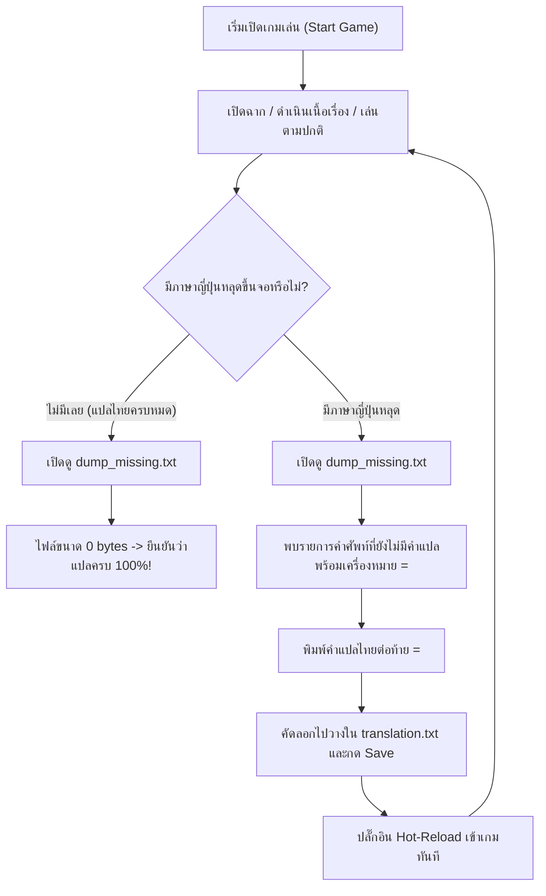

# คู่มือระบบบันทึกและดักจับข้อความ (Dump System Guide)
**เกม:** Village in the Shade (ほの暮しの庭) PC Steam Version  
**โฟลเดอร์:** `Mods\TextDump\`  
**โมดูลควบคุม:** `text_dump.dll` (Engine Hook & Live Translator)  

---

## 1. ตารางสรุปการแบ่งหน้าที่ของทั้ง 3 ไฟล์หลัก (แนวทางในอนาคต)

| ชื่อไฟล์ | หน้าที่และสิ่งที่บันทึก | ประโยชน์หลัก | สถานะการทำงาน |
| :--- | :--- | :--- | :--- |
| **`dump_log_...txt`** | บันทึกทุกคำ ทุกรอบ ทุกวินาที พร้อม Timestamp ตามลำดับเวลาจริง | เอาไว้ตรวจสอบ Timeline การแสดงผล และตรวจหาบั๊กเชิงลึก (เช่น อนิเมชันพิมพ์ดีด, ลำดับการเรียกฟอนต์) | บันทึกต่อเนื่องทุกครั้งที่เกมวาดข้อความ |
| **`dump_unique_...txt`** | บันทึกคำศัพท์ทั้งหมดที่เกมเรียกใช้อย่างละ 1 ครั้ง (ตัดคำซ้ำออก) | เอาไว้ดูภาพรวมคลังคำศัพท์ทั้งหมดที่เกมมี และนำไปทำสถิติ/ตรวจสอบความครอบคลุมของระบบ | บันทึกทุกข้อความใหม่ที่ไม่เคยเจอมาก่อน |
| **`dump_missing_...txt`**<br>*(ระบบใหม่)* | บันทึก**เฉพาะคำที่หลุดภาษาญี่ปุ่น** (คำที่ขึ้นบนจอแต่ยังไม่มีใน `translation.txt`) | **เอาไว้เช็กคำตกหล่นหลังเล่น และนำไปใส่คำแปลต่อท้าย `=` แล้วนำเข้า `translation.txt` ได้ทันที 100%** | บันทึกเฉพาะคำภาษาญี่ปุ่นที่ไม่มีคำแปล |

---

## 2. โครงสร้างและการจัดเก็บไฟล์ (Directory Architecture)

ระบบแบ่งการจัดเก็บออกเป็น 2 ระดับเพื่อความสะดวกในการทำงาน:

```
Mods\TextDump\
 │
 ├── dump_missing.txt             <-- [ไฟล์ด่วน] รวมคำตกหล่นเฉพาะรอบล่าสุด (0 bytes = แปลครบ 100%)
 ├── dump_unique.txt              <-- [ไฟล์ด่วน] รวมคำศัพท์ไม่ซ้ำเฉพาะรอบล่าสุด
 ├── dump_log.txt                 <-- [ไฟล์ด่วน] ล็อกการวาดข้อความรอบล่าสุด
 ├── text_dump.log                <-- บันทึกสถานะปลั๊กอิน (จำนวนคำที่ตรวจพบ, จำนวนการแทนที่)
 ├── translation.txt              <-- พจนานุกรมคำแปลภาษาไทยหลักของเกม
 │
 └── dumps\                       <-- [โฟลเดอร์ประวัติ] แยกตามวันเวลาที่เปิดเล่นจริง
      ├── dump_missing_YYYYMMDD_HHMMSS.txt  (สร้างเฉพาะเมื่อมีคำหลุดในรอบนั้น)
      ├── dump_unique_YYYYMMDD_HHMMSS.txt   (บันทึกคำศัพท์เฉพาะของรอบนั้น)
      └── dump_log_YYYYMMDD_HHMMSS.txt      (ประวัติการวาดข้อความของรอบนั้น)
```

> **ข้อดีของระบบนี้:**  
> - ไฟล์หลักในโฟลเดอร์ `Mods\TextDump\` จะถูกเริ่มใหม่ทุกครั้งที่เปิดเกม ทำให้ไฟล์ไม่บวมเป็นร้อยเมกะไบต์อีกต่อไป  
> - ไฟล์ในโฟลเดอร์ `dumps\` จะเก็บประวัติย้อนหลังตามวันเวลาอย่างเป็นระเบียบ ไม่ทับซ้อนกัน  

---

## 3. เจาะลึกการทำงานของแต่ละไฟล์และแนวทางการใช้งาน

### 3.1. `dump_missing_...txt` (ไฟล์ดักจับคำแปลที่ตกหล่น - สำคัญที่สุดสำหรับการแปล)

#### กฎเกณฑ์ในการดักจับ (Filter Conditions):
ข้อความจะถูกบันทึกลงในไฟล์นี้ก็ต่อเมื่อผ่านเงื่อนไขครบทั้ง 4 ข้อ:
1. **ถูกส่งไปวาดบนหน้าจอจริง:** ผ่านฟังก์ชัน `putStr`, `putStrProp` หรือ `putStrAlign`
2. **ยังไม่มีคำแปล:** ฟังก์ชัน `lookup_translation` ค้นหาใน `translation.txt` แล้วคืนค่า `NULL`
3. **เป็นภาษาญี่ปุ่นแท้:** ฟังก์ชัน `has_japanese_utf8` ตรวจพบอักขระฮิรางานะ (Hiragana), คาตากานะ (Katakana), คันจิ (CJK Kanji) หรือวรรคตอนภาษาญี่ปุ่น (คำภาษาอังกฤษ, ตัวเลข, สัญลักษณ์ทั่วไปจะไม่ถูกนำมาบันทึก)
4. **ไม่บันทึกซ้ำ:** มีระบบ Hash Table จดจำคำที่บันทึกไปแล้ว บันทึกเพียงครั้งเดียวตลอดรอบการเล่น

#### รูปแบบข้อมูลในไฟล์ (Ready-to-Translate Syntax):
```ini
// [MISSING:00001 putStr]
奇跡を呼ぶ歌=

// [MISSING:00002 putStr]
、吹いてみるね=
```

#### วิธีนำไปใช้งาน:
1. เล่นเกมตามปกติในด่านหรือเนื้อเรื่องที่ต้องการตรวจสอบ
2. หลังเล่นเสร็จ (หรือเปิดเกมทิ้งไว้) ให้เปิดดูไฟล์ `dump_missing.txt`:
   - **กรณีที่ 1: ไฟล์ว่างเปล่า (0 bytes)**  
     แสดงว่า **ทุกข้อความที่แสดงบนหน้าจอในรอบนี้ แปลเป็นไทยครบถ้วน 100% แล้ว!**
   - **กรณีที่ 2: มีข้อความในไฟล์**  
     พิมพ์คำแปลภาษาไทยใส่ต่อท้ายเครื่องหมาย `=` เช่น:
     ```ini
     // [MISSING:00001 putStr]
     奇跡を呼ぶ歌=บทเพลงแห่งปาฏิหาริย์
     ```
3. คัดลอกทั้งบล็อกไปวางต่อท้ายใน `translation.txt` แล้วบันทึกไฟล์ ตัวปลั๊กอินจะ Hot-reload คำแปลใหม่เข้าสู่เกมทันทีโดยไม่ต้องเปิดเกมใหม่

---

### 3.2. `dump_unique_...txt` (คลังคำศัพท์ไม่ซ้ำ)

#### ลักษณะข้อมูล:
- รวบรวมทุกสตริงที่เกมส่งเข้าสู่ระบบฟอนต์ โดยไม่สนใจว่าแปลแล้วหรือยัง หรือเป็นภาษาอะไร
- รูปแบบ:
  ```c
  /* ID:00001 [putStrAlign] */ このゲームは1日の終了時にオートセーブされ、
  /* ID:00002 [putStrAlign] */ 最新のデータが上書きされます。
  /* ID:00010 [putStrAlign] */ 3
  ```

#### ประโยชน์หลัก:
- ใช้ตรวจสอบภาพรวมว่าในรอบการเล่นนั้น เกมมีการเรียกใช้ข้อความทั้งหมดกี่คำ
- ใช้สำหรับทำดัชนีคำศัพท์เปรียบเทียบระหว่างเวอร์ชัน

---

### 3.3. `dump_log_...txt` (ประวัติการเรนเดอร์ข้อความตามเวลาจริง)

#### ลักษณะข้อมูล:
- บันทึกการวาดข้อความทุกชิ้นส่วน ทุกบรรทัด ทุกเฟรม พร้อมระบุชั่วโมง นาที วินาที
- รูปแบบ:
  ```text
  [00:39:10] [putStrAlign] 会話ログ
  [00:39:10] [putStrProp] 早送り
  [00:39:10] [putStrAlign] MaGi
  [00:39:10] [putStrAlign] 、キミも試しに
  [00:39:10] [putStrAlign] 吹いてみてもらっていい？
  ```

#### ประโยชน์หลัก:
- **ตรวจหาบั๊กข้อความหายหรือสระเพี้ยน:** สามารถดูได้ว่าเกมเรียกวาดบรรทัดไหนก่อน-หลัง
- **วิเคราะห์ระบบ Tag / โค้ดสี:** ดูว่าเอนจินเกมตัดประโยคตรงไหนก่อนส่งมาระบายสี
- **วิเคราะห์ Typewriter Effect:** ดูความถี่และลำดับการพิมพ์ตัวอักษรของเกม

---

## 4. แผนผังขั้นตอนการทำงานแปลและทดสอบเกม (Recommended Workflow)



---

## 5. สรุปคำแนะนำสำหรับการพัฒนาในอนาคต

1. **การตรวจสอบความสมบูรณ์ประจำวัน:**  
   เพียงเปิดดู `dump_missing.txt` หากเป็น 0 bytes ก็มั่นใจได้ทันทีว่าไม่มีข้อความหลุด
2. **การอ้างอิงย้อนหลัง:**  
   สามารถเข้าไปดูในโฟลเดอร์ `dumps\` เพื่อตรวจสอบว่าการทดสอบในวันและเวลาใดมีคำตกหล่นหลงเหลืออยู่บ้าง
3. **การทำงานร่วมกับ Hot-Reload:**  
   เมื่อเติมคำแปลใน `translation.txt` แล้ว เกมจะนำไปใช้ทันทีในรอบการแสดงผลถัดไปโดยไม่ต้องรีสตาร์ทตัวเกม
