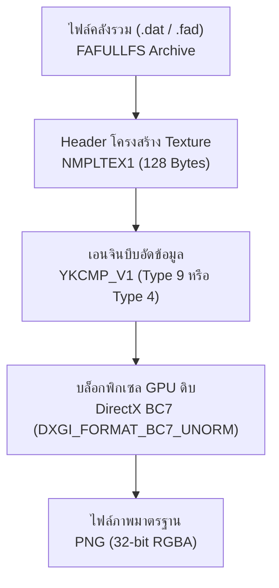
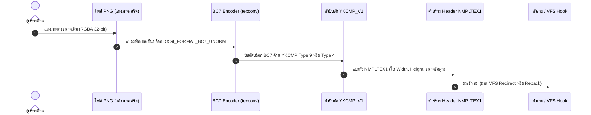

# คู่มือกระบวนการแปลงไฟล์ Texture (Game to PNG & PNG to Game Pipeline)
**เกม:** *Village in the Shade* (ほの暮しの庭 / 静谧田园)  
**เอนจิน:** Nippon Ichi Software Proprietary Engine (DirectX 11)

---

## 1. ภาพรวมสถาปัตยกรรม Texture ของเกม

ไฟล์ภาพกราฟิกในเกมไม่ได้ถูกเก็บเป็นไฟล์ PNG/JPEG แบบปกติ แต่ถูกจัดเก็บเป็นเลเยอร์ซ้อนกัน 4 ชั้นเพื่อประสิทธิภาพในการเรนเดอร์ผ่าน GPU:



---

## 2. ขั้นตอนการแปลงจากไฟล์เกมเป็น PNG (Game ➔ PNG)

กระบวนการถอดรหัสต้องผ่านทั้งหมด 4 ขั้นตอนตามลำดับ:

### ขั้นที่ 1: แกะไฟล์จากคลัง Archive (Unpack Container)
- ไฟล์ประเภท UI ทั่วไปถูกเก็บไว้ใน `texture_1_00.dat` (ฟอร์แมต **FAFULLFS**)
- ไฟล์กราฟิกไตเติลและอนิเมชันรวมอยู่ใน `fairy_1_00.dat` ➔ `data/fairy/resident_lang_jp.fad`
- สคริปต์จะอ่าน Table of Contents (TOC) เพื่อหาตำแหน่งไบต์เริ่มต้น (Offset) และขนาด (Size) ของ Texture แต่ละตัว

### ขั้นที่ 2: อ่าน Header `NMPLTEX1` (ขนาด 128 ไบต์)
เมื่อกระโดดไปยังตำแหน่ง Texture จะพบ Header มาตรฐานของ NIS:
- **Magic:** `NMPLTEX1` (8 ไบต์)
- **Offset `+0x18` (4 ไบต์, uint32):** ความกว้างของภาพ (Width) เช่น `2048`
- **Offset `+0x1C` (4 ไบต์, uint32):** ความสูงของภาพ (Height) เช่น `512`
- **Offset `+0x30` (4 ไบต์, uint32):** ขนาดก้อนข้อมูลบีบอัด (Payload Size)
- **Offset `+0x34` (4 ไบต์, uint32):** จุดเริ่มต้นของ Payload (โดยทั่วไปคือ `0x80` = 128 ไบต์)

### ขั้นที่ 3: คลายการบีบอัด `YKCMP_V1` (Decompress)
ที่จุดเริ่มต้นของ Payload จะพบ Header `YKCMP_V1` ขนาด 20 ไบต์:
- **Magic:** `YKCMP_V1` (8 ไบต์)
- **Type (`+0x08`):** รูปแบบอัลกอริทึม
  - **Type 9 (LZ4):** ใช้ในไฟล์แยกหลวม (`.nltx`) คลายด้วย `lz4.block.decompress`
  - **Type 4 (Custom LZSS Sliding Window):** ใช้ในไฟล์คอนเทนเนอร์ `.fad` (ถอดรหัสจากโค้ด `village.exe` ที่ตำแหน่ง VA `0x1408CB740`)
- **Compressed Size (`+0x0C`):** ขนาดบีบอัดรวม Header 20 ไบต์
- **Uncompressed Size (`+0x10`):** ขนาดข้อมูลดิบหลังคลายบีบอัด (เท่ากับ $Width \times Height$ ไบต์สำหรับ BC7)

> [!NOTE]
> **หลักการทำงานของ YKCMP Type 4 (Sliding Window):**
> อ่านไบต์ควบคุม `b`:
> 1. ถ้า `b < 0x80`: สำเนาข้อมูลตรง (Literal) ความยาว `b` ไบต์
> 2. ถ้า `0x80 <= b < 0xC0`: สำเนาซ้ำระยะสั้น ความยาว `((b >> 4) & 3) + 1`, ถอยหลัง `(b & 0xF) + 1`
> 3. ถ้า `0xC0 <= b < 0xE0`: สำเนาซ้ำระยะกลาง ความยาว `(b & 0x1F) + 2`, ถอยหลัง `NextByte + 1`
> 4. ถ้า `b >= 0xE0`: สำเนาซ้ำระยะไกล ความยาว `(((b & 0x1F) << 4) | (b1 >> 4)) + 3`, ถอยหลัง `(((b1 & 0xF) << 8) | b2) + 1`

### ขั้นที่ 4: ถอดรหัสบล็อก BC7 สู่ภาพ PNG (GPU Block Decoding)
- ข้อมูลที่คลายออกมาคือข้อมูล **DirectX BC7 (DXGI_FORMAT_BC7_UNORM)**
- แต่ละบล็อกขนาด $4 \times 4$ พิกเซล กินพื้นที่ 16 ไบต์
- ใช้ฟังก์ชัน `texture2ddecoder.decode_bc7(raw_bc7, width, height)` ถอดรหัสเป็นพิกเซลสีดิบ (Raw BGRA)
- สลับช่องสีและบันทึกเป็นไฟล์ภาพ PNG ด้วย Pillow (`Image.frombytes('RGBA', (w, h), data, 'raw', 'BGRA')`)

---

## 3. ขั้นตอนการแปลงกลับเข้าสู่เกม (PNG ➔ Game)

เพื่อนำภาพที่แก้ไขแล้ว (เช่น แปลไทยข้อความ `Press any button` ➔ `กดปุ่มใดก็ได้` หรือเปลี่ยนชื่อไตเติล) นำกลับไปแสดงผลในเกม ต้องทำย้อนกระบวนการเดิมทั้งหมด:



---

### ขั้นตอนปฏิบัติการแปลงกลับแบบ Step-by-Step

#### ขั้นที่ 1: เตรียมรูปภาพ PNG
1. ต้องคงขนาด Resolution เท่าเดิมเป๊ะๆ (เช่น `ui_1000_title01.png` ต้องเป็น **2048 x 512** พิกเซล)
2. บันทึกเป็นโหมด **RGBA 32-bit** (มี Alpha Channel ความโปร่งใส)

#### ขั้นที่ 2: แปลง PNG เป็นบล็อก BC7 ดิบ
ใช้เครื่องมือมาตรฐาน **`texconv.exe`** ของ Microsoft DirectXTex:
```cmd
texconv.exe -f BC7_UNORM -m 1 -nologo -o output/ ui_1000_title01.png
```
- `-f BC7_UNORM`: บีบอัดเป็นฟอร์แมต BC7 คุณภาพสูงที่เกมใช้
- `-m 1`: สร้าง Mipmap เพียง 1 ระดับ (เนื่องจากเป็น 2D UI)
- จากนั้นอ่านข้อมูลดิบเฉพาะส่วน Payload ข้าม Header DDS 148 ไบต์แรก จะได้ข้อมูล BC7 ดิบขนาดพอดีเท่ากับ $(Width \times Height)$ ไบต์

#### ขั้นที่ 3: บีบอัดด้วย `YKCMP_V1`
- นำข้อมูลบล็อก BC7 ดิบมาบีบอัดด้วย LZ4 (Type 9):
```python
import lz4.block
import struct

# บีบอัดด้วย LZ4
comp_data = lz4.block.compress(raw_bc7, mode='high_compression', store_size=False)
comp_size = len(comp_data) + 20
uncomp_size = len(raw_bc7)

# สร้าง Header YKCMP_V1 (20 ไบต์)
# Magic (8B) + Type (4B) + CompSize (4B) + UncompSize (4B)
ykcmp_header = struct.pack('<8sIII', b'YKCMP_V1', 9, comp_size, uncomp_size)
ykcmp_payload = ykcmp_header + comp_data
```

#### ขั้นที่ 4: ประกอบโครงสร้าง `NMPLTEX1`
สร้าง Header NMPLTEX1 ขนาด 128 ไบต์:
```python
nmpl_header = bytearray(128)
nmpl_header[0:8] = b'NMPLTEX1'
struct.pack_into('<II', nmpl_header, 0x18, width, height)
struct.pack_into('<II', nmpl_header, 0x30, len(ykcmp_payload), 128)

# รวมเป็นไฟล์ .nltx สมบูรณ์
full_nltx = bytes(nmpl_header) + ykcmp_payload
```

---

## 4. แนวทางการนำไฟล์ใหม่กลับไปแสดงในเกม (3 วิธี)

| วิธีการ | รายละเอียด | ข้อดี | ข้อเสีย / ข้อจำกัด |
| :--- | :--- | :--- | :--- |
| **วิธีที่ 1: VFS Hook (แนะนำ)** | ใช้ DLL Mod (`text_dump.dll`) ดักจับจังหวะที่เกมเรียกอ่าน Offset ของรูปนั้นๆ แล้วแทนที่ข้อมูลในหน่วยความจำ RAM ด้วยไบต์ใหม่ทันที | • ไม่แตะต้องไฟล์เกมเดิม<br>• ถอนการติดตั้งง่าย<br>• ปลอดภัย 100% ไม่เสี่ยงไฟล์เกมเสีย | ต้องเขียนตรรกะ Redirect ใน DLL |
| **วิธีที่ 2: In-Place Patch** | เขียนไบต์ทับลงไปในตำแหน่งเดิมของไฟล์ `.dat` ตรงๆ | ทำงานได้ทันทีโดยไม่ต้องรัน VFS | ขนาดไฟล์ที่บีบอัดใหม่ **ต้องไม่ใหญ่กว่าของเดิม** (ถ้าเล็กกว่าให้เติม `0x00` Padding) |
| **วิธีที่ 3: Archive Repack** | แตกไฟล์ทั้งคลังด้วย QuickBMS แทนที่ไฟล์ แล้ว Pack กลับเข้าไปใหม่ทั้งหมด | รองรับไฟล์ขนาดใหญ่ขึ้นได้เต็มที่ | ใช้เวลาเขียนไฟล์ขนาด 2 GB ใหม่ทั้งหมด |

---

## 5. สรุปตำแหน่งไฟล์สำคัญสำหรับไตเติลภาษาไทย

- สคริปต์สกัดภาพไตเติลทั้งหมด:  
  [extract_title_elements.py](file:///C:/Users/Supakiat/Desktop/Village_in_the_Shade_ThaiMod_Dev/scripts/extract_title_elements.py)
- โฟลเดอร์เก็บไฟล์ภาพ PNG ที่สกัดแล้ว:  
  `C:\Users\Supakiat\Desktop\Village_in_the_Shade_ThaiMod_Dev\extracted_textures\title_elements\`
  - `ui_1000_title01.png` ➔ โลโก้หลัก, ปุ่ม `Press any button`, เมนูเข้าเกม
  - `ui_1000_Localize_00.png` ➔ โลโก้ภาษาอังกฤษ `VILLAGE IN THE SHADE`
  - `title_white.png` ➔ มาสก์สีขาวสำหรับเรืองแสง
